<div align="center">

<picture>
  <source media="(prefers-color-scheme: dark)" srcset=".github/assets/banner-dark.svg">
  <source media="(prefers-color-scheme: light)" srcset=".github/assets/banner-light.svg">
  
</picture>

<p>
  
  
  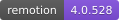
  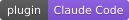
  
  
</p>

<strong>A central de mídia do método Expx.</strong><br>
Você instala, conta quem a empresa é, e pede a peça.<br>
Post, carrossel, reel, apresentação e aula saem com a <em>sua</em> marca, a <em>sua</em> voz e o <em>seu</em> público.

<p>
  <a href="#veja-o-que-ele-produz"><strong>🎬 Vitrine</strong></a>
  &nbsp;·&nbsp;
  <a href="#como-começar">Como começar</a>
  &nbsp;·&nbsp;
  <a href="#o-reel-por-referência">Reel por referência</a>
  &nbsp;·&nbsp;
  <a href="motor/README.md">Referência do CLI</a>
  &nbsp;·&nbsp;
  <a href="docs/contrato/">Contratos</a>
</p>

</div>

---

## Veja o que ele produz

Tudo abaixo foi **produzido pelo próprio núcleo**, pelo CLI, para uma empresa que não existe —
a *Padaria Trigo Dourado*, a Alma fictícia dos testes — **sem nenhuma chave de API**: a voz é o
provedor de teste e nada saiu da máquina. Com as chaves no `.env`, a mesma linha de comando usa a
voz clonada, o avatar e as imagens geradas da sua empresa.

<table>
<tr>
<td align="center" width="33%">
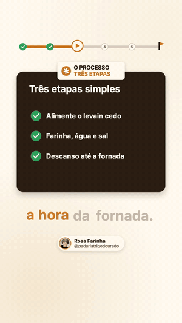<br>
<sub><b>Reel narrado</b> · 9:16<br>template <code>reel/narrado-cartao</code> em Remotion,<br>legenda por blocos presa à fala</sub>
</td>
<td align="center" width="33%">
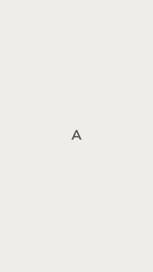<br>
<sub><b>Reel por referência</b> · 9:16<br>código Remotion <b>novo</b>, escrito a partir<br>da leitura de um vídeo de referência</sub>
</td>
<td align="center" width="33%">
<br>
<sub><b>Carrossel misto</b> · 4:5<br>slide de vídeo MP4 no meio<br>dos slides de imagem</sub>
</td>
</tr>
</table>

<table>
<tr>
<td align="center" width="50%">
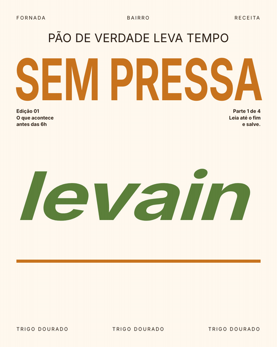<br>
<sub><b>Carrossel</b> · 4:5 · template <code>carrossel/editorial</code></sub>
</td>
<td align="center" width="50%">
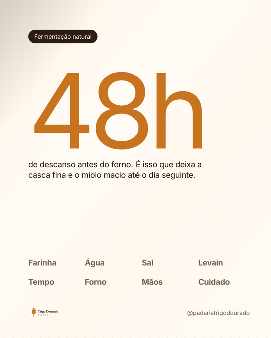<br>
<sub><b>Post único</b> · 4:5 · template <code>post_unico/numero-e-frase</code></sub>
</td>
</tr>
</table>

<p align="center">
  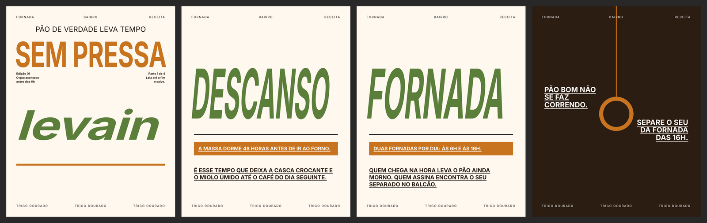<br>
  <sub>A prancha que o motor grava junto de todo carrossel — o texto é encaixado, e o contraste é <b>medido no PNG</b>, não no CSS.</sub>
</p>

<table>
<tr>
<td align="center" width="50%">
<br>
<sub><b>Apresentação</b> · 16:9 · MP4 e PNG por slide</sub>
</td>
<td align="center" width="50%">
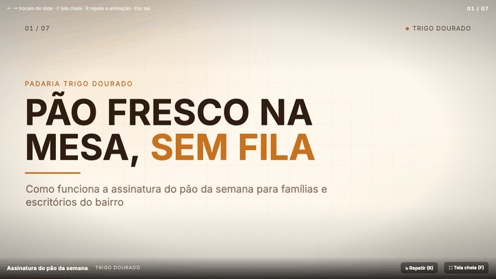<br>
<sub>…e a mesma apresentação como <b>HTML navegável</b>, um arquivo só, sem internet</sub>
</td>
</tr>
<tr>
<td align="center" width="50%">
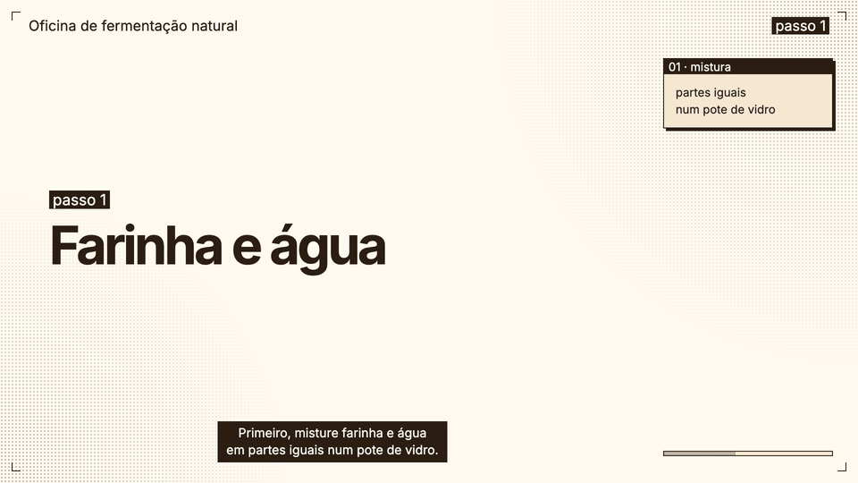<br>
<sub><b>Aula</b> · 16:9 com legenda 42×2 e SRT</sub>
</td>
<td align="center" width="50%">
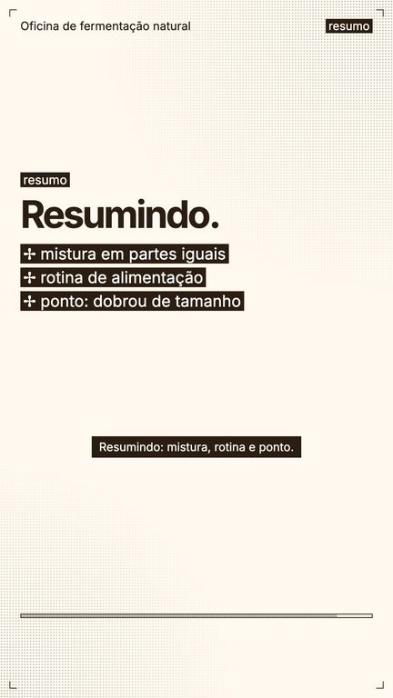<br>
<sub>a mesma aula em <b>9:16</b>, da mesma fonte</sub>
</td>
</tr>
</table>

<sub>Reproduza a vitrine com <code>cd motor &amp;&amp; uv run python scripts/gerar_vitrine.py</code> — o comando exato de cada peça está em <a href=".github/assets/vitrine/manifesto.json"><code>manifesto.json</code></a>.</sub>

---

## Índice

| | |
|---|---|
| **[Por que existe](#por-que-existe)** | o problema de fazer mídia com IA sem perder a cara da empresa |
| **[O ecossistema](#o-ecossistema)** | o núcleo produz, o pack especializa |
| **[O primeiro uso](#o-primeiro-uso-alma-e-ambiente)** | a Alma da empresa e o `.env` que só liga o que tem chave |
| **[Capacidades](#capacidades-o-que-liga-com-o-quê)** | 16 capacidades, quais funcionam sem chave |
| **[A peça](#a-peça-um-contrato-para-tudo-que-é-produzido)** | um contrato para post, carrossel, reel, apresentação e aula |
| **[O reel por referência](#o-reel-por-referência)** | a joia da casa: um vídeo novo, parecido com o que você mostrou |
| **[Qualidade medida](#qualidade-medida)** | paridade com o sistema anterior, provada por teste |
| **[Arquitetura](#arquitetura)** · **[Contratos](#os-contratos)** · **[Ordem de construção](#ordem-de-construção)** · **[Como começar](#como-começar)** | o resto |

---

## Por que existe

Uma IA escreve um post em segundos. O difícil é o post seguinte parecer da **mesma empresa** —
mesma voz, mesmas cores, mesmo público, mesma qualidade — e o vídeo sair com a legenda presa à
fala, o áudio a −14 LUFS e nada de texto escondido atrás da interface do Instagram.

O ExpxMedia é esse conjunto de restrições, escrito e testado:

- **A marca não mora no código.** Mora na **Alma** da empresa. Troque a Alma e o mesmo motor
  produz para outra empresa sem mudar um byte — e um teste varre o código a cada rodada para
  garantir que nenhuma marca vazou para dentro dele.
- **Recurso sem chave não existe.** Nada quebra por falta de conta: o que precisa de chave só
  aparece quando a chave está no `.env`, e o sistema diz exatamente qual falta e onde conseguir.
- **A inteligência é portada com os números.** Limiares, pesos e tempos que levaram meses para
  calibrar vieram junto, com a referência `arquivo:linha` de onde saíram.
- **Quem produz não aprova.** Revisores têm só leitura e checklists vindos da prática.

---

## O ecossistema

<picture>
  <source media="(prefers-color-scheme: dark)" srcset=".github/assets/ecossistema-dark.svg">
  <source media="(prefers-color-scheme: light)" srcset=".github/assets/ecossistema-light.svg">
  
</picture>

O **núcleo** (este repositório) já **produz** os cinco tipos de peça — com ele sozinho, uma empresa
faz post, carrossel, reel, apresentação e aula com a própria marca. Os **packs** acrescentam o que
é de um canal: regras e limites, editorial, planejamento, métricas, análise e a aba do painel.

| | O que traz | Estado |
|---|---|---|
| **núcleo** | Alma, motor de capacidades, produção dos 5 tipos, plugin `expxmedia` | ✅ pronto |
| `expx-instagram` | séries, ganchos, cadência, métricas do Instagram, recriação | em breve |
| `expx-youtube` | analytics do canal, roteiro, títulos, capítulos | em breve |
| `expx-meta` | conta de anúncios, placar, teto de gasto, testes A/B | em breve |
| `expx-cursos` | ementa, curso, módulo e aula | em breve |
| `expx-galeria` | camada: templates de todo mundo, consultados antes de criar | em breve |

---

## O primeiro uso: Alma e ambiente

<picture>
  <source media="(prefers-color-scheme: dark)" srcset=".github/assets/primeiro-uso-dark.svg">
  <source media="(prefers-color-scheme: light)" srcset=".github/assets/primeiro-uso-light.svg">
  
</picture>

Na primeira vez que **qualquer** skill roda, um hook do plugin confere o portão — de forma
determinística, antes da primeira ação do modelo:

1. **Sem Alma?** `/expxmedia:alma` cria a identidade da empresa **pelo site** (o motor lê a página,
   extrai nome, ofertas, cores e logotipo, sem inventar nada — o que não tem evidência vira
   pendência) **ou por entrevista**. Você confere a proposta inteira e diz *confirmo tudo*.
2. **Sem `.env`?** `/expxmedia:ambiente` cria o arquivo e explica, bloco a bloco, o que cada chave
   liga e onde conseguir. A chave vai **no arquivo**, nunca na conversa.
3. Pronto: é pedir a peça.

<details>
<summary><b>Um pedaço de <code>alma/alma.json</code></b></summary>

```json
{
  "expxmedia_alma": 1,
  "empresa": { "nome": "Padaria Trigo Dourado", "fuso": "America/Sao_Paulo" },
  "voz": { "tom": ["acolhedor", "simples", "bem-humorado"], "tratamento": "voce", "palavras_proibidas": ["gourmet"] },
  "visual": {
    "cores": { "fundo": "#FFF8EE", "texto": "#2B1D12", "destaque": "#C8731E", "destaque_2": "#5B7F3A" },
    "fontes": { "titulo": { "familia": "Fraunces", "origem": "google" } }
  },
  "porta_vozes": [
    { "id": "porta-voz-teste", "nome": "Rosa Farinha",
      "voz": { "provedor": "elevenlabs", "voz_id": "…", "pronuncia": [{ "termo": "levain", "fala": "levã" }] } }
  ]
}
```

Os templates nunca pedem "o laranja" — pedem o **papel** `destaque`. É isso que faz o mesmo
template servir a qualquer empresa. Contrato completo em
[`CONTRATO-alma.md`](docs/contrato/CONTRATO-alma.md).
</details>

---

## Capacidades: o que liga com o quê

<picture>
  <source media="(prefers-color-scheme: dark)" srcset=".github/assets/capacidades-dark.svg">
  <source media="(prefers-color-scheme: light)" srcset=".github/assets/capacidades-light.svg">
  
</picture>

Packs e templates **nunca falam de provedor**: pedem uma capacidade (`narrar`) e o motor escolhe
quem faz. Trocar de serviço é mudar o `.env`, não o código. Com dois provedores de publicação
configurados, `PROVEDOR_PUBLICAR` escolhe o padrão — e o sistema **nunca troca de canal em
silêncio**, porque publicar por um canal que ninguém escolheu é uma ação para fora que ninguém
autorizou.

```sh
# narrar — voz clonada do porta-voz em reels, aulas e apresentações
ELEVENLABS_API_KEY=
# publicar, agendar, automacao_dm — pelo Expx Flow (agenda no servidor)
EXPXFLOW_API_KEY=
EXPXFLOW_CLIENT_ID=
EXPXFLOW_BASE_URL=
# publicar, agendar — Graph API direta (o agendador local publica com a máquina ligada)
META_GRAPH_TOKEN=
META_IG_USER_ID=
PROVEDOR_PUBLICAR=expxflow
```

---

## A peça: um contrato para tudo que é produzido

<picture>
  <source media="(prefers-color-scheme: dark)" srcset=".github/assets/ciclo-peca-dark.svg">
  <source media="(prefers-color-scheme: light)" srcset=".github/assets/ciclo-peca-light.svg">
  
</picture>

Toda peça — de qualquer tipo, de qualquer pack — grava o mesmo `peca.json`, e toda transição vira
um evento no rastro. É o que permite comparar um reel com um carrossel, saber que template dá
resultado e montar a linha do tempo da empresa inteira.

| Tipo | Formatos | Saída |
|---|---|---|
| `post_unico` | 4:5 · 1:1 · 9:16 | PNG |
| `carrossel` | 4:5 · 1:1 | PNG por slide — **ou MP4**, no carrossel misto |
| `reel` | 9:16 | MP4 com legenda presa à fala, −14 LUFS |
| `apresentacao` | 16:9 | HTML navegável, PNG por slide e MP4 |
| `aula` | 16:9 e 9:16 | MP4 + SRT por formato, com avatar e tela opcionais |

A publicação grava a **intenção antes de enviar** e **nunca retenta** um envio que falhou: um
retry cego é como um post sai duas vezes.

---

## O reel por referência

<picture>
  <source media="(prefers-color-scheme: dark)" srcset=".github/assets/reel-referencia-dark.svg">
  <source media="(prefers-color-scheme: light)" srcset=".github/assets/reel-referencia-light.svg">
  
</picture>

<table>
<tr>
<td width="260" align="center"></td>
<td>

Você manda um reel de que gostou. O ExpxMedia devolve um reel **parecido** — mesma composição,
mesma sequência de cenas, mesmo jeito de animar, mesmo estilo de legenda — mas **com o seu
assunto, a sua voz e a sua marca**, e sem copiar nada: nem frase, nem quadro, nem áudio, nem logo.

O segredo não é um algoritmo, é o **processo**: o modelo lê as folhas de quadros a 1 por segundo
(o detector automático de cortes enxergou "3 cenas" onde havia uma troca a cada 3 segundos),
escreve a leitura em 9 seções e só então escreve **código Remotion novo** para aquele reel —
nunca um template genérico. Uma prévia com as guias da área segura é comparada às folhas em até 3
voltas, e um revisor só de leitura aprova com um checklist de parecença, item por item, com o
quadro que prova cada um.

O GIF ao lado saiu **dessa validação**, feita seguindo a skill sobre um vídeo de referência real.

</td>
</tr>
</table>

---

## Qualidade medida

<picture>
  <source media="(prefers-color-scheme: dark)" srcset=".github/assets/qualidade-dark.svg">
  <source media="(prefers-color-scheme: light)" srcset=".github/assets/qualidade-light.svg">
  
</picture>

O núcleo foi extraído de cinco sistemas que já produziam em série. "Não perder qualidade" virou
teste — as saídas do sistema anterior foram gravadas como **goldens** e o núcleo é comparado a elas:

| O que | Como é provado | Resultado |
|---|---|---|
| Render de carrossel | mesmo layout, mesma entrada, pixel a pixel | **0%** de diferença |
| Linha do tempo e trilha do reel | `timeline.json` e `trilha.wav` do sistema anterior | **byte a byte** iguais |
| Legenda do reel em PNG | blocos, `legendas.json` e cada PNG | iguais, ≤ 1% de pixel |
| Legenda de aula 42×2 e SRT | contra a aula publicada | idênticos |
| Escolha do trecho no corte | contra a transcrição de um corte real | mesmo trecho |
| Entrega de vídeo | 11 checagens por perfil (duração, LUFS, pico, área segura, sincronia, cauda…) | um artefato defeituoso por checagem |

No caminho, a extração também **corrigiu** defeitos do sistema anterior — a leitura de cor
`color(srgb …)` no contraste, a queda para a fonte embarcada sem rede, e a publicação atrasada em
silêncio ao acordar a máquina. Todas as divergências estão em
[`validacao/divergencias.md`](docs/nucleo-expxmedia/validacao/divergencias.md).

---

## Arquitetura

```
motor/                      o núcleo em Python (uv, pytest) — CLI expxmedia-motor
  src/expxmedia/
    nucleo/ ambiente/ alma/ peca/ template/        contratos em código
    render_html/ motion/ video/ narrar/            capacidades
    transcrever/ legendar/ imagem/ captura/
    avatar/ corte/ referencia/ aula/
    publicar/ agendador/ revisar/                  publicação e revisão
    producao/                                      os 5 tipos de peça
    cli.py + cli_comandos/                         43 subcomandos, saída JSON
  kit-remotion/             kit TypeScript: FPS único, useAlma, selo, montagem e trilha
  tests/                    1131 testes · goldens do sistema anterior · e2e pelo CLI
nucleo/                     o plugin expxmedia do Claude Code: 11 skills, 7 agentes, hooks
templates/                  templates embarcados: post, carrossel, reel, apresentação, aula
docs/contrato/              os 7 contratos
docs/nucleo-expxmedia/      o plano (sprintx): base, decisões, sprints, auditorias, validação
```

O motor foi planejado e executado com o próprio método Expx
([`sprintx`](https://github.com/bittencourtthulio/sprintx)): 37 arquivos de base de conhecimento,
50 decisões, 10 sprints, 100 tasks em TDD e quatro rodadas de auditoria independente até o plano
estar pronto — tudo em [`docs/nucleo-expxmedia/`](docs/nucleo-expxmedia/ORQUESTRADOR.md).

---

## Os contratos

| Documento | O que define |
|---|---|
| [`CONVENCOES.md`](docs/contrato/CONVENCOES.md) | as regras M1–M16, válidas em todo artefato |
| [`CONTRATO-alma.md`](docs/contrato/CONTRATO-alma.md) | a identidade da empresa e o portão de primeiro uso |
| [`CONTRATO-capacidades.md`](docs/contrato/CONTRATO-capacidades.md) | o que o sistema sabe fazer, quem faz e que chave habilita |
| [`CONTRATO-peca.md`](docs/contrato/CONTRATO-peca.md) | todo conteúdo produzido: post, carrossel, reel, apresentação, aula |
| [`CONTRATO-template.md`](docs/contrato/CONTRATO-template.md) | templates, galeria local e galeria compartilhada |
| [`CONTRATO-estado-eventos.md`](docs/contrato/CONTRATO-estado-eventos.md) | rastro, daily, decisões, plano do dia, relatórios |
| [`CONTRATO-pack.md`](docs/contrato/CONTRATO-pack.md) | o que um pack ou camada declara ao ser instalado |

---

## Ordem de construção

1. Contratos ✅
2. Núcleo ✅ — o motor em Python com as capacidades e a produção genérica dos cinco tipos de peça ([`motor/`](motor/README.md)) e o plugin `expxmedia` do Claude Code ([`nucleo/`](nucleo/README.md)), sem pack nenhum
3. Central — CLI (TypeScript, a partir do expxdev) e casca do painel
4. `expx-instagram` — o pack piloto
5. `expx-galeria` — camada, versão local
6. `expx-youtube`
7. `expx-meta`
8. `expx-cursos`
9. Galeria compartilhada (`expxmedia-gallery`)

---

## Como começar

1. Prepare o motor uma vez por máquina (precisa de rede): `cd motor && uv run python scripts/preparar_ambiente.py`.
   Requisitos (Python 3.11+, uv, Node 20, ffmpeg 8) e a referência do CLI em [`motor/README.md`](motor/README.md).
2. Na raiz deste repositório, abra o Claude Code com o plugin do núcleo: `claude --plugin-dir nucleo`.
3. Rode `/expxmedia:alma` para montar a Alma da empresa; em seguida o portão leva ao
   `/expxmedia:ambiente`, que cria o `.env`. Depois disso, é pedir a peça: *"faz um carrossel
   sobre…"*, *"recria esse reel…"*, *"transforma essa apresentação numa aula"*.

> **Sobre o Remotion.** O motor renderiza vídeo com [Remotion](https://www.remotion.dev/docs/terms).
> Empresas com fins lucrativos e 4 ou mais pessoas precisam da própria licença do Remotion para
> renderizar. Consulte os termos antes de usar em produção.

---

## Licença

MIT

<div align="center">
<sub>Parte do método <strong>Expx</strong> ·
<a href="https://github.com/bittencourtthulio/expxdev">expxdev</a> ·
expxmedia</sub>
</div>
